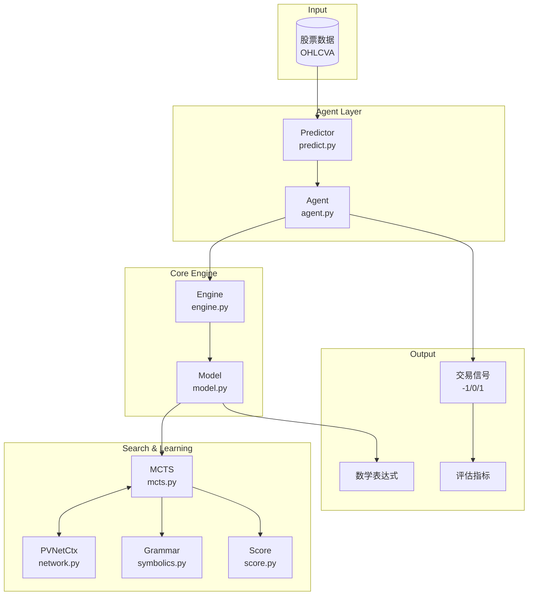
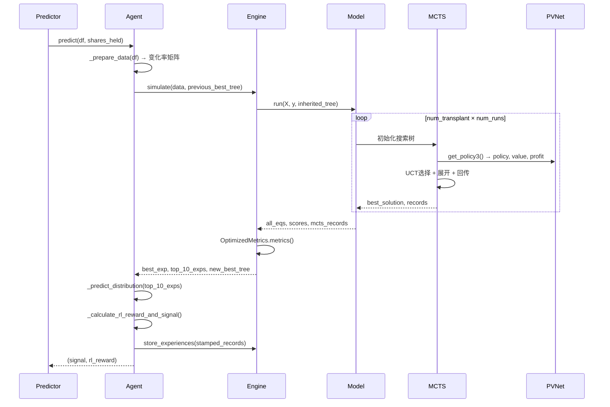

# EATA: Explainable Algorithmic Trading Agent via Symbolic Regression

[](https://www.python.org/downloads/)
[](https://pytorch.org/)
[](https://opensource.org/licenses/MIT)

**EATA** (Explainable Algorithmic Trading Agent) 是一个基于**符号回归**和**蒙特卡洛树搜索 (MCTS)** 的可解释量化交易系统。该系统通过自动发现数学表达式来预测价格分布，从而生成可解释的交易信号。

## 核心创新

1. **符号回归驱动的价格预测**: 使用 MCTS + 神经网络引导的符号回归，自动发现描述市场动态的数学公式
2. **双头价值网络**: 同时预测表达式精度 (V_accuracy) 和交易盈利 (V_profit)
3. **语法树继承机制**: 滑动窗口间传递最优表达式，实现热启动加速
4. **可解释性**: 输出人类可读的数学表达式，而非黑盒模型

## 最新实验结果

31支股票对比测试（2020-2024）：

| 策略 | 年化收益 | 排名 |
|------|----------|------|
| **EATA** | **25.63%** | 🥇 |
| Buy & Hold | 13.43% | 2 |
| MACD | 6.62% | 3 |
| Transformer | 6.53% | 4 |
| PPO | 2.11% | 5 |
| LSTM | -5.23% | 6 |
| ARIMA | -23.09% | 7 |

---

## 项目结构

```
eata/
├── agent.py                    # 核心Agent类，集成决策流程
├── predict.py                  # 预测器与回测入口
├── main.py                     # 定时调度入口
├── evaluate.py                 # 评估模块
├── visualize.py                # Streamlit可视化
├── performance_metrics.py      # 交易指标计算
│
├── eata_agent/                 # 核心算法模块
│   ├── engine.py               # 引擎层：训练循环与经验管理
│   ├── model.py                # 模型层：MCTS编排与语法管理
│   ├── mcts.py                 # MCTS搜索：UCT + 神经网络融合
│   ├── network.py              # PVNet：策略-价值-盈利三头网络
│   ├── score.py                # 表达式评分与系数优化
│   ├── symbolics.py            # 语法规则库（含金融函数）
│   ├── environment.py          # 滑动窗口环境
│   ├── tracker.py              # 训练指标追踪
│   └── args.py                 # 超参数配置
│
├── comparison_experiments/     # 对比实验框架
│   ├── algorithms/             # 基线策略实现
│   │   ├── eata.py             # EATA策略封装
│   │   ├── buy_and_hold.py     # 买入持有
│   │   ├── macd.py             # MACD策略
│   │   ├── transformer.py      # Transformer
│   │   ├── ppo.py              # PPO强化学习
│   │   ├── lstm.py             # LSTM预测
│   │   ├── gp.py               # 遗传规划
│   │   ├── arima.py            # ARIMA
│   │   └── baseline.py         # 统一运行器
│   └── data/                   # 实验数据
│
├── run_experiments.py          # 批量实验脚本
└── requirements.txt            # 依赖列表
```

---

## 快速开始

### 安装依赖

```bash
pip install -r requirements.txt
```

### 运行单股票回测

```bash
python predict.py --project_name my_test
```

### 运行对比实验

```bash
# 单参数集实验
python run_experiments.py --mode single --tickers AAPL MSFT GOOGL --runs 3

# 参数扫描实验
python run_experiments.py --mode sweep --tickers AAPL MSFT --runs 5
```

### 启动可视化界面

```bash
streamlit run visualize.py
```

---

## 系统架构

### 整体架构图



### 核心流程



---

## 核心模块详解

### 1. Agent (`agent.py`)

Agent是系统的决策核心，负责：
- **数据预处理**: 将OHLCVA转换为变化率矩阵
- **符号回归调用**: 通过Engine发现最优数学表达式
- **分布预测**: 使用Top-10表达式生成未来价格分布
- **信号生成**: 基于Q25/Q75分位数规则生成交易信号
- **经验管理**: 将RL奖励"盖戳"到MCTS经验上

```python
# 核心决策流程
action, rl_reward = agent.criteria(df, shares_held)
```

### 2. Engine (`eata_agent/engine.py`)

Engine是训练循环的控制中心：
- **simulate()**: 执行一次完整的符号回归搜索
- **train()**: 使用经验池训练神经网络
- **store_experiences()**: 接收带RL奖励的经验数据

```python
# 三头损失函数
total_loss = value_loss + profit_loss + policy_loss
```

### 3. Model (`eata_agent/model.py`)

Model负责MCTS的编排和语法管理：
- **动态语法生成**: 根据输入维度自动生成变量终结符
- **语法增强**: 维护高质量子表达式库 (aug_grammars)
- **搜索控制**: 管理num_transplant × num_runs的嵌套循环

### 4. MCTS (`eata_agent/mcts.py`)

蒙特卡洛树搜索的核心实现：
- **UCT公式**: `Q/N + C * sqrt(ln(N_parent)/N)`
- **神经网络融合**: `policy = α * policy_nn + (1-α) * policy_ucb`
- **双头价值融合**: `value = w * V_accuracy + (1-w) * V_profit`
- **语法树继承**: 支持从上一窗口继承最优树

### 5. PVNet (`eata_agent/network.py`)

三头策略-价值网络：
- **输入**: 状态序列 (LSTM) + 语法树嵌入 (Embedding)
- **输出**: 
  - `policy`: 下一步语法规则的概率分布
  - `value`: 表达式精度预测
  - `profit`: 交易盈利预测

### 6. Score (`eata_agent/score.py`)

表达式评分与系数优化：
- **score_with_est()**: 计算 `reward = 1 / (1 + MSE)`
- **系数估计**: 使用Powell优化器估计表达式中的常数C

### 7. Symbolics (`eata_agent/symbolics.py`)

语法规则库，包含：
- **基础运算**: `+, -, *, /, cos, sin, exp, log, sqrt`
- **金融函数**: `delay, ma, diff, mom, rsi, volatility`
- **动态终结符**: `x0, x1, ..., xn` (对应OHLCVA特征)

---

## 超参数配置

| 参数 | 默认值 | 说明 |
|------|--------|------|
| `lookback` | 50 | 回看窗口长度 |
| `lookahead` | 10 | 预测窗口长度 |
| `stride` | 1 | 滑动步长 |
| `depth` | 300 | 搜索深度 |
| `max_len` | 35 | 表达式最大长度 |
| `num_transplant` | 5 | 语法增强轮数 |
| `num_runs` | 5 | 每轮MCTS运行次数 |
| `transplant_step` | 800 | 每次MCTS的episode数 |
| `lr` | 1e-5 | 学习率 |
| `train_size` | 64 | 训练批次大小 |

---

## 评估指标

系统使用 `TradingMetrics` 类计算完整的交易指标：

| 指标 | 说明 |
|------|------|
| Annual Return (AR) | 年化收益率 |
| Sharpe Ratio | 夏普比率 |
| Sortino Ratio | 索提诺比率 |
| Max Drawdown (MDD) | 最大回撤 |
| Calmar Ratio | 卡玛比率 |
| Win Rate | 胜率 |
| Profit Factor | 盈利因子 |
| Alpha | 超额收益 |
| Beta | 市场敏感度 |

---

## 对比实验框架

`comparison_experiments/` 提供了完整的基线对比框架：

```python
from comparison_experiments.algorithms.baseline import BaselineRunner

runner = BaselineRunner()
results = runner.run_real_data_experiment(
    ticker='AAPL',
    strategies=['eata', 'buy_and_hold', 'macd', 'transformer'],
    lookback=50,
    lookahead=10
)
```

支持的策略：
- **EATA**: 本项目的符号回归方法
- **Buy & Hold**: 买入持有基准
- **MACD**: 技术指标策略
- **Transformer**: 深度学习预测
- **PPO**: 强化学习策略
- **LSTM**: 序列预测模型
- **GP**: 遗传规划
- **LightGBM**: 梯度提升
- **ARIMA**: 时间序列模型

---

## 输出文件

运行后生成的文件：
- `asset_curve_{project}_{ticker}.png`: 资产曲线图
- `rl_reward_trend_{project}_{ticker}.png`: RL奖励趋势图
- `EATA_Strategy_Report_{project}_{ticker}.html`: QuantStats详细报告
- `experiment_results/`: 实验结果CSV文件

---

## 依赖环境

```
torch>=2.0.1
numpy>=1.23.2
pandas>=1.5.0
scipy>=1.9.0
sympy>=1.11
gplearn>=0.4.2
quantstats>=0.0.62
streamlit>=1.32.0
matplotlib>=3.8.3
seaborn>=0.13.2
```

---

## 引用

如果您使用了本项目，请引用：

```bibtex
@article{eata2024,
  title={EATA: Explainable Algorithmic Trading Agent via Symbolic Regression},
  author={...},
  journal={...},
  year={2024}
}
```

---

## License

MIT License
