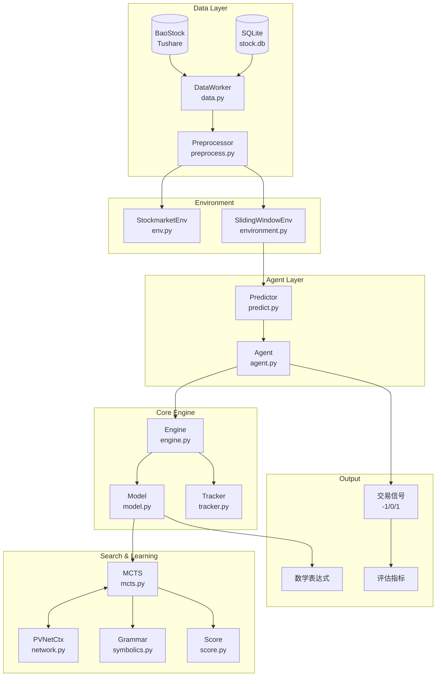
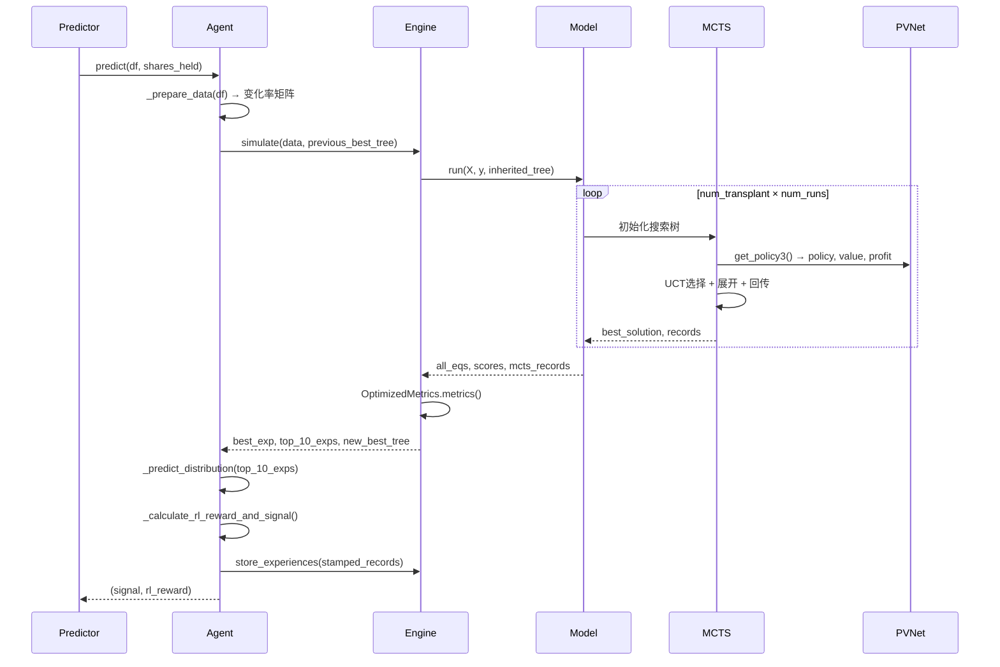

# EATA: Explainable Algorithmic Trading Agent via Symbolic Regression

[](https://www.python.org/downloads/)
[](https://pytorch.org/)
[](https://opensource.org/licenses/MIT)

**EATA** (Explainable Algorithmic Trading Agent) 是一个基于**符号回归**和**蒙特卡洛树搜索 (MCTS)** 的可解释量化交易系统。该系统通过 **NEMoTS** (Neural-enhanced Monte Carlo Tree Search) 框架自动发现数学表达式来预测价格分布，从而生成可解释的交易信号。

## 核心创新

1. **符号回归驱动的价格预测**: 使用 MCTS + 神经网络引导的符号回归，自动发现描述市场动态的数学公式
2. **三头策略-价值-盈利网络 (PVNet)**: 同时输出策略分布 (policy)、表达式精度 (value) 和交易盈利 (profit)
3. **语法树继承机制**: 滑动窗口间传递最优表达式，实现热启动加速搜索
4. **双目标训练 (Q25/Q75)**: 支持同时预测价格分布的上下分位数，用于风险评估
5. **可解释性**: 输出人类可读的数学表达式，而非黑盒模型
6. **金融专用语法库**: 包含 `delay`, `ma`, `diff`, `mom`, `rsi`, `volatility` 等金融时序函数

## 支持的对比策略

项目支持以下策略的对比实验：

| 策略           | 模块                | 类型            |
| -------------- | ------------------- | --------------- |
| **EATA** | `eata.py`         | 符号回归 + MCTS |
| Buy & Hold     | `buy_and_hold.py` | 基准策略        |
| MACD           | `macd.py`         | 技术指标        |
| ARIMA          | `arima.py`        | 时间序列        |
| GP             | `gp.py`           | 遗传规划        |
| LightGBM       | `lgb_strategy.py` | 机器学习        |
| LSTM           | `lstm.py`         | 深度学习        |
| Transformer    | `transformer.py`  | 深度学习        |
| PPO            | `ppo.py`          | 强化学习        |

> **注**: 运行 `python comparison_experiments/algorithms/baseline.py` 可执行完整对比实验，结果保存在 `comparison_results/` 目录

---

## 项目结构

```
eata/
├── agent.py                    # 核心Agent类，集成决策流程
├── predict.py                  # 预测器与回测入口
├── main.py                     # 定时调度入口（schedule调度）
├── evaluate.py                 # 评估模块（分类指标+收益指标）
├── visualize.py                # Streamlit可视化Web界面
├── performance_metrics.py      # 交易指标计算（TradingMetrics类）
├── backtest.py                 # 通用回测框架
│
├── data.py                     # 数据存储与获取（SQLite + BaoStock/Tushare）
├── preprocess.py               # 数据预处理（Preprocessor类）
├── env.py                      # Gym风格股票环境（StockmarketEnv）
├── globals.py                  # 全局常量与配置
├── utils.py                    # 工具函数（拐点检测、可视化等）
│
├── sliding_window_nemots.py    # 滑动窗口NEMoTS封装
├── run_experiments.py          # 批量实验脚本（参数扫描）
│
├── chandelier.py               # Chandelier Exit策略
├── reflex.py                   # Trendflex策略
├── karea.py                    # K线面积策略
├── QQE.py                      # QQE策略
│
├── eata_agent/                 # 核心算法模块
│   ├── engine.py               # 引擎层：训练循环与经验管理
│   ├── model.py                # 模型层：MCTS编排与语法管理
│   ├── mcts.py                 # MCTS搜索：UCT + 神经网络融合
│   ├── network.py              # PVNet：策略-价值-盈利三头网络
│   ├── score.py                # 表达式评分与系数优化
│   ├── symbolics.py            # 语法规则库（含金融函数）
│   ├── environment.py          # 滑动窗口环境（SlidingWindowEnv）
│   ├── tracker.py              # 训练指标追踪与可视化
│   ├── dual_target_train.py    # 双目标(Q25/Q75)训练脚本
│   ├── args.py                 # 超参数配置容器
│   └── utils/                  # 工具模块
│       ├── metrics.py          # MAE/MSE/RSE/CORR等指标
│       └── tools.py            # 学习率调整/早停/标准化
│
├── comparison_experiments/     # 对比实验框架
│   ├── __init__.py             # 模块初始化
│   ├── algorithms/             # 基线策略实现
│   │   ├── arima.py            # ARIMA时间序列预测
│   │   ├── baseline.py         # 统一运行器（BaselineRunner）
│   │   ├── buy_and_hold.py     # 买入持有策略
│   │   ├── data_utils.py       # 数据加载与技术指标计算
│   │   ├── eata.py             # EATA策略封装
│   │   ├── finrl_strategies.py # FinRL框架策略集成
│   │   ├── gp.py               # 遗传规划策略
│   │   ├── lgb_strategy.py     # LightGBM机器学习策略
│   │   ├── lstm.py             # LSTM神经网络策略
│   │   ├── macd.py             # MACD技术指标策略
│   │   ├── ppo.py              # PPO强化学习策略
│   │   └── transformer.py      # Transformer深度学习策略
│   ├── core/                   # 核心框架
│   │   ├── base_algorithm.py   # 算法基类（统一fit/predict/backtest接口）
│   │   ├── config_manager.py   # 实验配置管理
│   │   └── experiment_runner.py # 实验执行器（批量运行+报告生成）
│   ├── data/                   # 实验数据目录
│   ├── evaluation/             # 评估结果目录
│   └── reports/                # 实验报告目录
│
└── requirements.txt            # 依赖列表
```

---

## 快速开始

### 安装依赖

```bash
pip install -r requirements.txt
```

### 数据准备

项目支持两种数据源：

1. **BaoStock**: 中国A股数据（需要网络连接）
2. **SQLite数据库**: 本地存储的股票数据

```python
# 从BaoStock获取数据
from data import BaostockDataWorker
dw = BaostockDataWorker()
df = dw.latest("sh.600000", ktype="d", days=500)

# 从本地数据库加载
from data import DataStorage
ds = DataStorage()
df = ds.load_raw()
```

### 运行单股票回测

```bash
python predict.py --project_name my_test
```

### 运行对比实验

```bash
# 单参数集实验
python run_experiments.py --mode single --tickers AAPL MSFT GOOGL --runs 3

# 参数扫描实验
python run_experiments.py --mode sweep --tickers AAPL MSFT --runs 5

# 生成汇总报告
python run_experiments.py --mode summary
```

### 运行双目标训练 (Q25/Q75)

```bash
cd eata_agent
python dual_target_train.py --epoch 50 --lookBACK 84 --lookAHEAD 10
```

### 启动可视化界面

```bash
streamlit run visualize.py
```

---

## 系统架构

### 整体架构图



### 核心流程



---

## 核心模块详解

### 1. Agent (`agent.py`)

Agent是系统的决策核心，负责：

- **数据预处理**: 将OHLCVA转换为变化率矩阵
- **符号回归调用**: 通过Engine发现最优数学表达式
- **分布预测**: 使用Top-10表达式生成未来价格分布
- **信号生成**: 基于Q25/Q75分位数规则生成交易信号
- **经验管理**: 将RL奖励"盖戳"到MCTS经验上

```python
# 核心决策流程
action, rl_reward = agent.criteria(df, shares_held)
```

### 2. Engine (`eata_agent/engine.py`)

Engine是训练循环的控制中心：

- **simulate()**: 执行一次完整的符号回归搜索
- **train()**: 使用经验池训练神经网络
- **store_experiences()**: 接收带RL奖励的经验数据

```python
# 三头损失函数
total_loss = value_loss + profit_loss + policy_loss
```

### 3. Model (`eata_agent/model.py`)

Model负责MCTS的编排和语法管理：

- **动态语法生成**: 根据输入维度自动生成变量终结符
- **语法增强**: 维护高质量子表达式库 (aug_grammars)
- **搜索控制**: 管理num_transplant × num_runs的嵌套循环

### 4. MCTS (`eata_agent/mcts.py`)

蒙特卡洛树搜索的核心实现：

- **UCT公式**: `Q/N + C * sqrt(ln(N_parent)/N)`
- **神经网络融合**: `policy = α * policy_nn + (1-α) * policy_ucb`
- **双头价值融合**: `value = w * V_accuracy + (1-w) * V_profit`
- **语法树继承**: 支持从上一窗口继承最优树

### 5. PVNet (`eata_agent/network.py`)

三头策略-价值网络：

- **输入**: 状态序列 (LSTM) + 语法树嵌入 (Embedding)
- **输出**:
  - `policy`: 下一步语法规则的概率分布
  - `value`: 表达式精度预测
  - `profit`: 交易盈利预测

### 6. Score (`eata_agent/score.py`)

表达式评分与系数优化：

- **score_with_est()**: 计算 `reward = 1 / (1 + MSE)`
- **系数估计**: 使用Powell优化器估计表达式中的常数C
- **time_limit**: 超时保护，防止复杂表达式计算过久

### 7. Symbolics (`eata_agent/symbolics.py`)

语法规则库，包含：

- **基础运算**: `+, -, *, /, cos, sin, exp, log, sqrt`
- **金融函数**: `delay, ma, diff, mom, max_n, min_n, rsi, volatility, ite`
- **动态终结符**: `x0, x1, ..., xn` (对应OHLCVA特征)
- **gen_enhanced_finance_grammar()**: 动态生成金融专用语法

### 8. Tracker (`eata_agent/tracker.py`)

训练过程追踪与可视化：

- **基础指标**: alpha, policy_entropy, value, reward, best_score
- **双目标指标**: mae_q25, mae_q75, q_violations, q_diff
- **可视化**: 预测vs实际对比图、误差分析图、交易风险热图
- **generate_final_report()**: 生成完整评估报告

### 9. 数据模块

#### DataStorage (`data.py`)

- SQLite数据库管理（stock.db / stock_large.db）
- 支持raw/processed/trained/evaluated/history多表存储

#### Preprocessor (`preprocess.py`)

- 数据清洗（BaoStock/Tushare格式统一）
- 技术指标计算（EMA, RSI等）
- 归一化处理（z-score/standardization/div_pre_close）
- 拐点标记（Bry-Boschan算法）
- 奖励函数附加

#### StockmarketEnv (`env.py`)

- Gym风格的股票交易环境
- 多层级数据：5分钟线、日线、板块、大盘
- 支持滑动窗口状态返回

---

## 超参数配置

| 参数                             | 默认值      | 说明                |
| -------------------------------- | ----------- | ------------------- |
| `lookback` / `seq_in`        | 50 / 84     | 回看窗口长度        |
| `lookahead` / `seq_out`      | 10 / 12     | 预测窗口长度        |
| `stride`                       | 1           | 滑动步长            |
| `depth`                        | 300         | 搜索深度            |
| `max_len`                      | 25-35       | 表达式最大长度      |
| `num_transplant`               | 5           | 语法增强轮数        |
| `num_runs`                     | 3-5         | 每轮MCTS运行次数    |
| `transplant_step`              | 500-800     | 每次MCTS的episode数 |
| `lr`                           | 1e-5 ~ 1e-6 | 学习率              |
| `train_size` / `buffer_size` | 64-128      | 训练批次/经验池大小 |
| `exploration_rate`             | 1/√2       | UCT探索系数         |
| `eta`                          | 1.0         | 价值融合权重        |
| `num_aug`                      | 5           | 语法增强数量        |

---

## 评估指标

系统使用 `TradingMetrics` 类计算完整的交易指标：

| 指标               | 说明       |
| ------------------ | ---------- |
| Annual Return (AR) | 年化收益率 |
| Sharpe Ratio       | 夏普比率   |
| Sortino Ratio      | 索提诺比率 |
| Max Drawdown (MDD) | 最大回撤   |
| Calmar Ratio       | 卡玛比率   |
| Win Rate           | 胜率       |
| Profit Factor      | 盈利因子   |
| Alpha              | 超额收益   |
| Beta               | 市场敏感度 |

---

## 对比实验框架

`comparison_experiments/` 提供了完整的基线对比框架：

```python
from comparison_experiments.algorithms.baseline import BaselineRunner

runner = BaselineRunner()
results = runner.run_real_data_experiment(
    ticker='AAPL',
    strategies=['eata', 'buy_and_hold', 'macd', 'transformer'],
    lookback=50,
    lookahead=10
)
```

支持的策略（定义于 `baseline.py` 的 `STRATEGY_CONFIGS`）：

| 策略名         | 模块               | 需要训练 | 说明                 |
| -------------- | ------------------ | -------- | -------------------- |
| `buy_and_hold` | `buy_and_hold.py`  | 否       | 买入持有策略         |
| `macd`         | `macd.py`          | 否       | MACD交叉策略         |
| `arima`        | `arima.py`         | 是       | ARIMA时间序列预测    |
| `gp`           | `gp.py`            | 是       | 遗传编程策略         |
| `lightgbm`     | `lgb_strategy.py`  | 是       | LightGBM机器学习策略 |
| `lstm`         | `lstm.py`          | 是       | LSTM神经网络策略     |
| `transformer`  | `transformer.py`   | 是       | Transformer模型策略  |
| `ppo`          | `ppo.py`           | 是       | PPO强化学习策略      |
| `eata`         | `eata.py`          | 是       | EATA符号回归策略     |

FinRL 原版策略（定义于 `finrl_strategies.py`，需单独调用）：

| 策略名       | 函数                       | 说明                    |
| ------------ | -------------------------- | ----------------------- |
| FinRL-PPO    | `run_finrl_ppo_strategy`   | FinRL原版PPO策略        |
| FinRL-A2C    | `run_finrl_a2c_strategy`   | FinRL原版A2C策略        |
| FinRL-SAC    | `run_finrl_sac_strategy`   | FinRL原版SAC策略        |
| FinRL-TD3    | `run_finrl_td3_strategy`   | FinRL原版TD3策略        |
| FinRL-DDPG   | `run_finrl_ddpg_strategy`  | FinRL原版DDPG策略       |

> **注**: FinRL策略需要安装 `finrl` 和 `stable-baselines3` 依赖

---

## 其他交易策略

项目还包含多种传统技术分析策略：

| 策略            | 文件              | 说明                            |
| --------------- | ----------------- | ------------------------------- |
| Chandelier Exit | `chandelier.py` | 基于ATR的趋势跟踪止损策略       |
| Trendflex       | `reflex.py`     | Ehlers超级平滑器 + 趋势反转检测 |
| K线面积         | `karea.py`      | 基于K线面积的多空信号策略       |
| QQE             | `QQE.py`        | 量化质量评估策略                |

这些策略均实现了统一的 `choose_action(s)` 接口，可与EATA进行对比。

---

## 输出文件

运行后生成的文件：

### 回测输出

- `asset_curve_{project}_{ticker}.png`: 资产曲线图
- `rl_reward_trend_{project}_{ticker}.png`: RL奖励趋势图
- `EATA_Strategy_Report_{project}_{ticker}.html`: QuantStats详细报告

### 实验输出

- `experiment_results/`: 实验结果CSV文件
- `experiment_results_lookback{lb}_lookahead{la}_stride{s}_depth{d}_{ticker}_{timestamp}.csv`
- `master_experiment_summary_{timestamp}.csv`: 主汇总文件

### 双目标训练输出

- `logs/dual_target/`: 训练日志和图表
- `evaluation/predictions.csv`: 预测结果
- `evaluation/evaluation_metrics.json`: 评估指标

---

## 依赖环境

```
torch>=2.0.1
numpy>=1.23.2
pandas>=1.5.0
scipy>=1.9.0
sympy>=1.11
gplearn>=0.4.2
quantstats>=0.0.62
streamlit>=1.32.0
matplotlib>=3.8.3
seaborn>=0.13.2
baostock>=0.8.8
tushare>=1.2.89
stockstats>=0.5.4
schedule>=1.2.0
gymnasium>=0.29.0
```

---

## 技术细节

### 滑动窗口NEMoTS (`sliding_window_nemots.py`)

封装了核心NEMoTS算法的滑动窗口版本：

- **语法树继承**: 前一窗口的最优解传递给下一窗口作为热启动
- **动态参数调整**: 首次窗口使用重量级参数，后续窗口使用轻量级参数
- **变化率标准化**: 将OHLCVA转换为变化率，限制在合理范围内

### 经验回放机制

- **数据缓冲区**: 使用 `collections.deque` 管理经验池
- **RL奖励盖戳**: Agent将Wasserstein距离奖励附加到MCTS经验上
- **批量训练**: 当经验池达到阈值时触发神经网络训练

### 语法增强 (Grammar Augmentation)

- **模块提取**: 从高质量表达式中提取子表达式
- **动态规则**: 将子表达式作为新的语法规则加入搜索空间
- **热启动**: 使用增强后的语法加速后续搜索

---

## 工具函数 (`utils.py`)

项目提供了丰富的工具函数：

### 拐点检测算法

- **landmarks()**: MDPP算法实现，基于距离和百分比阈值过滤拐点
- **landmarks_BB()**: Bry-Boschan算法，用于经济周期拐点检测
- **super_smoother()**: Ehlers超级平滑滤波器

### 数据验证

- **validate()**: DataFrame合法性检查（类型、列、索引）

### 可视化

- **depict()**: 绘制价格曲线与拐点标记
- **plot_signal()**: 绘制交易信号图

---

## 全局配置 (`globals.py`)

| 常量            | 值                                              | 说明             |
| --------------- | ----------------------------------------------- | ---------------- |
| `WINDOW_SIZE` | 20                                              | 默认滑动窗口大小 |
| `LookBack`    | 50                                              | 回看天数         |
| `LookAhead`   | 10                                              | 预测天数         |
| `OCLHVA`      | ['open','close','low','high','volume','amount'] | 价格列名         |
| `indicators`  | ['close_5_ema','close_10_ema','rsi',...]        | 技术指标列名     |
| `REWARD`      | ['buy_reward','hold_reward','sell_reward']      | 奖励列名         |

---

## 引用

如果您使用了本项目，请引用：

```bibtex
@article{eata2024,
  title={EATA: Explainable Algorithmic Trading Agent via Symbolic Regression},
  author={...},
  journal={...},
  year={2024}
}
```

---

## License

MIT License
