# EATA-RL: Reinforcement Learning Enhanced Algorithmic Trading Agent

This project presents `EATA-RL`, an enhanced version of the Explainable Algorithmic Trading Agent that integrates **Reinforcement Learning feedback mechanisms** for continuous self-optimization.

## 🚀 RL增强版新特性

### 核心升级
- **🧠 智能反馈系统** (`rl.py`) - 基于交易结果的强化学习反馈
- **🔄 自适应参数调整** - 动态优化NEMoTS超参数
- **🎯 闭环学习机制** - reward→策略增强, loss→参数调整
- **🔧 自我修复能力** - 检测性能下降时自动重启搜索

### 技术架构
- **Agent增强** - RL反馈集成的决策引擎
- **NEMoTS升级** - 增强版滑动窗口与分位数训练
- **实时学习** - 每次交易后自动优化模型参数

## 📊 性能表现
31支股票对比测试：
- **EATA-RL: 25.63%+** 年化收益（持续优化中）
- **EATA原版: 25.63%** 年化收益（第一名）
- 买入持有: 13.43%
- MACD: 6.62%
- Transformer: 6.53%
- 其他策略: 2.11% ~ -23.09%

**RL增强版在保持原有性能的基础上，具备了持续自我优化的能力。**

## Backtest Architecture (main.py entry)


- **调度**: `main.py` 使用 `schedule` 定时触发 `predict()`, `evaluate()`, `test_webserver()`。
- **预测**: `predict.Predictor` 可走 `NEMoTSPredictor`（符号回归）或 Bandwagon；动作写入 `Test/`。
- **评估**: `evaluate.Evaluator.asset_change()/class_perf()` 产出 `evaluated.csv`。
- **可视化**: `visualize.WebServer` 读取 `Test/` 与 `evaluated.csv`，以 Streamlit 展示。

## Full Reinforcement Learning (NEMoTS) Architecture

```mermaid
graph TD
    subgraph Data Prep
        DIn[（open,high,low,close,volume,amount:DF）]
        PreA[_prepare_training_data -FullNEMoTSAdapter / sliding_window_nemots]
        DIn --> PreA --> Tensor[X,y/window tensor]
    end

    subgraph Engine Layer
        Eng[Engine]
        Mod[Model]
        Eng -->|simulate X,y,inherited_tree?| Mod
    end

    subgraph Search & Policy
        M[MCTS]
        Adp[MCTSAdapter.patch_mcts]
        Net[PVNetCtx]
        Gram[grammar - symbolics.py]
        Score[score_with_est - score.py]
        Metric[OptimizedMetrics engine.py]
        Track[Tracker]
        Buffer[(data_buffer deque)]
    end

    Tensor --> Eng
    Mod -->|init/run| M
    Mod --> Gram
    Adp --> M
    M -->|get_policy3| Net
    M -->|update_modules/rollout| M
    M -->|records| Buffer
    Mod --> Buffer
    Eng -->|train uses| Track
    Mod -->|score_with_est| Score
    Eng -->|metrics| Metric

    subgraph Inheritance
        Prev[previous_best_expression/tree]
        Prev -->|inherited_tree| Eng
    end

    subgraph Outputs
        Best[best_exp]
        MAE[MAE/MSE/Corr]
        Policy[policy]
        Reward[reward]
    end

    Metric --> MAE
    Eng --> Best
    Eng --> Policy
    Eng --> Reward


```



- **数据准备**: `FullNEMoTSAdapter._prepare_training_data()` 或 `SlidingWindowNEMoTS._prepare_sliding_window_data()` 生成张量输入。
- **引擎**: `engine.Engine.simulate()` 调 `model.Model.run()`；`MCTSAdapter` 动态修补策略维度。
- **搜索/策略**: `MCTS` 结合 `PVNetCtx` 与 UCB；`score.score_with_est()` 打分；`Tracker` 采集训练指标；`data_buffer` 驱动 NN 融合系数。
- **继承**: 滑窗训练中将 `previous_best_expression` 作为 `inherited_tree` 传入，提升稳定性。
- **输出**: 最优表达式与评估指标（MAE/MSE/Corr/Reward）用于后续交易信号与回测。

## 模块依赖关系图


关键关系引用：

- [NEMoTSAdapter](cci:2://file:///Users/yin/Desktop/doing/eata/nemots_adapter.py:666:0-706:9) 统一入口，内部的 [NEMoTSPredictor](cci:2://file:///Users/yin/Desktop/doing/eata/nemots_adapter.py:461:0-664:39) 根据数据量选择：
  - 充足数据：[FullNEMoTSAdapter](cci:2://file:///Users/yin/Desktop/doing/eata/nemots_adapter.py:226:0-459:38) 调用 [nemots.engine.Engine.simulate()](cci:1://file:///Users/yin/Desktop/doing/eata/nemots/engine.py:26:4-52:80) → [model.Model.run()](cci:1://file:///Users/yin/Desktop/doing/eata/nemots/mcts.py:237:4-357:79) → [mcts.MCTS](cci:2://file:///Users/yin/Desktop/doing/eata/nemots/mcts.py:7:0-365:36) + `network.PVNetCtx`，并用 [mcts_adapter.MCTSAdapter](cci:2://file:///Users/yin/Desktop/doing/eata/nemots/mcts_adapter.py:17:0-165:24) 对齐维度，打分经 [score.score_with_est](cci:1://file:///Users/yin/Desktop/doing/eata/nemots/score.py:48:0-136:16) 与 [engine.OptimizedMetrics.metrics](cci:1://file:///Users/yin/Desktop/doing/eata/nemots/engine.py:164:4-280:39)。
  - 数据不足：[SimpleNEMoTS](cci:2://file:///Users/yin/Desktop/doing/eata/nemots_adapter.py:132:0-224:40) 在 [nemots_adapter.py](cci:7://file:///Users/yin/Desktop/doing/eata/nemots_adapter.py:0:0-0:0) 内部生成与评估符号表达式。
- [sliding_window_nemots.py](cci:7://file:///Users/yin/Desktop/doing/eata/sliding_window_nemots.py:0:0-0:0) 的 [SlidingWindowNEMoTS](cci:2://file:///Users/yin/Desktop/doing/eata/sliding_window_nemots.py:16:0-291:9) 直接构造 [Engine(Args)](cci:2://file:///Users/yin/Desktop/doing/eata/nemots/engine.py:16:0-160:12)，使用滑窗数据并将前一窗最佳表达式以继承方式传入 [simulate()](cci:1://file:///Users/yin/Desktop/doing/eata/nemots/engine.py:26:4-52:80)。

## 训练/预测时序图（完整 NEMoTS 路径）


## 补充说明

- **顶层入口**：

  - [nemots_adapter.py](cci:7://file:///Users/yin/Desktop/doing/eata/nemots_adapter.py:0:0-0:0) 提供统一接口：[NEMoTSAdapter.train()](cci:1://file:///Users/yin/Desktop/doing/eata/nemots_adapter.py:676:4-686:24), [NEMoTSAdapter.predict()](cci:1://file:///Users/yin/Desktop/doing/eata/nemots_adapter.py:688:4-693:48)。
  - [sliding_window_nemots.py](cci:7://file:///Users/yin/Desktop/doing/eata/sliding_window_nemots.py:0:0-0:0) 提供滑窗增强版本：[SlidingWindowNEMoTS.sliding_fit()](cci:1://file:///Users/yin/Desktop/doing/eata/sliding_window_nemots.py:160:4-220:13), [SlidingWindowNEMoTS.predict()](cci:1://file:///Users/yin/Desktop/doing/eata/sliding_window_nemots.py:222:4-272:20)，直接用 [Engine](cci:2://file:///Users/yin/Desktop/doing/eata/nemots/engine.py:16:0-160:12) 与 [Args](cci:2://file:///Users/yin/Desktop/doing/eata/nemots_adapter.py:237:8-297:90)。
- **核心搜索与评估链路**：

  - [nemots/model.py](cci:7://file:///Users/yin/Desktop/doing/eata/nemots/model.py:0:0-0:0) 中 [Model.run()](cci:1://file:///Users/yin/Desktop/doing/eata/nemots/model.py:69:4-252:80) 负责构建 [MCTS](cci:2://file:///Users/yin/Desktop/doing/eata/nemots/mcts.py:7:0-365:36)，组织 grammar（[symbolics.py](cci:7://file:///Users/yin/Desktop/doing/eata/nemots/symbolics.py:0:0-0:0)），引导搜索（`network.PVNetCtx`），并将搜索轨迹缓存到 `data_buffer`。
  - [nemots/mcts_adapter.py](cci:7://file:///Users/yin/Desktop/doing/eata/nemots/mcts_adapter.py:0:0-0:0) 的 [MCTSAdapter.patch_mcts()](cci:1://file:///Users/yin/Desktop/doing/eata/nemots/mcts_adapter.py:70:4-126:28) 对 [MCTS.get_policy3()](cci:1://file:///Users/yin/Desktop/doing/eata/nemots/mcts.py:207:4-214:28) 进行维度对齐，保证 NN 策略输出与 MCTS 语法空间一致。
  - [nemots/score.py](cci:7://file:///Users/yin/Desktop/doing/eata/nemots/score.py:0:0-0:0) 的 [score_with_est()](cci:1://file:///Users/yin/Desktop/doing/eata/nemots/score.py:48:0-136:16) 对表达式进行系数估计与评分，[nemots/engine.py](cci:7://file:///Users/yin/Desktop/doing/eata/nemots/engine.py:0:0-0:0) 的 [OptimizedMetrics.metrics()](cci:1://file:///Users/yin/Desktop/doing/eata/nemots/engine.py:164:4-280:39) 用于最终度量与表达式选择。
- **简化路径**：

  - [SimpleNEMoTS](cci:2://file:///Users/yin/Desktop/doing/eata/nemots_adapter.py:132:0-224:40) 在 [nemots_adapter.py](cci:7://file:///Users/yin/Desktop/doing/eata/nemots_adapter.py:0:0-0:0) 中，通过随机表达式模板与 [StockScorer.score_expression()](cci:1://file:///Users/yin/Desktop/doing/eata/nemots_adapter.py:71:4-130:34) 简化评估，数据不足时兜底。

---

## 🚀 RL增强版快速开始

### 安装依赖
```bash
pip install -r requirements.txt
```

### 使用RL增强版EATA
```python
from agent import Agent
import pandas as pd

# 创建RL增强版Agent
agent = Agent(pd.DataFrame(), lookback=100, lookahead=20)

# 进行交易决策（自动RL反馈学习）
trading_signal, rl_reward = agent.criteria(your_data, shares_held=0)

# 系统会自动：
# 1. 生成交易信号
# 2. 计算RL奖励
# 3. 调整模型参数
# 4. 持续自我优化
```

### 核心文件说明
- `rl.py` - 强化学习反馈系统
- `agent.py` - RL增强版EATA Agent
- `sliding_window_nemots.py` - 增强版NEMoTS引擎
- `predict.py` - 预测器主入口

### RL反馈机制
系统在每次交易决策后会：
1. **奖励反馈** - 基于预测准确性增强策略
2. **损失反馈** - 根据MAE调整NEMoTS超参数
3. **参数优化** - 动态调整探索率、学习率等
4. **自动重启** - 检测性能下降时重启搜索
